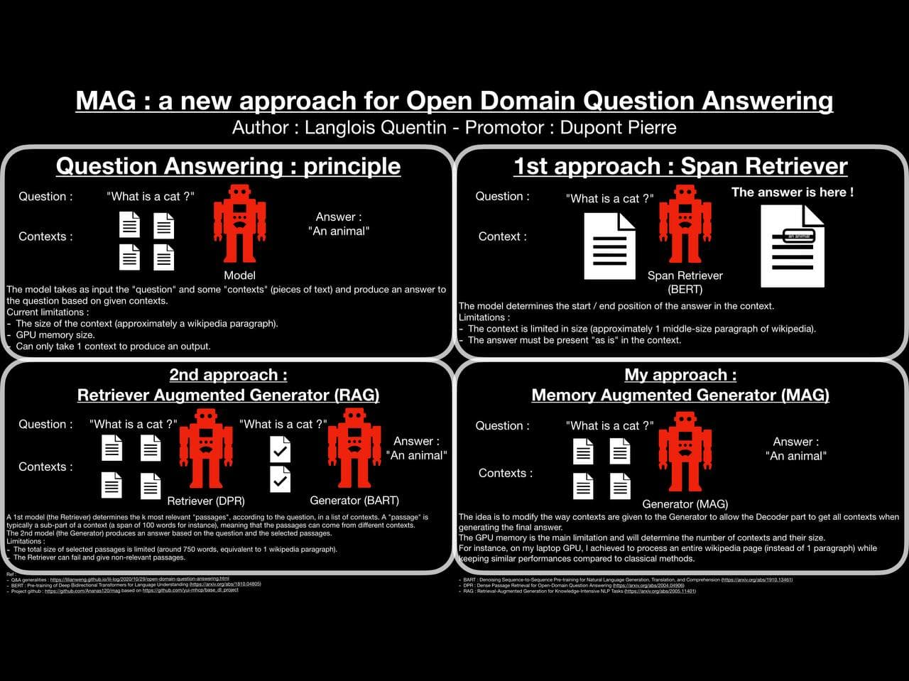
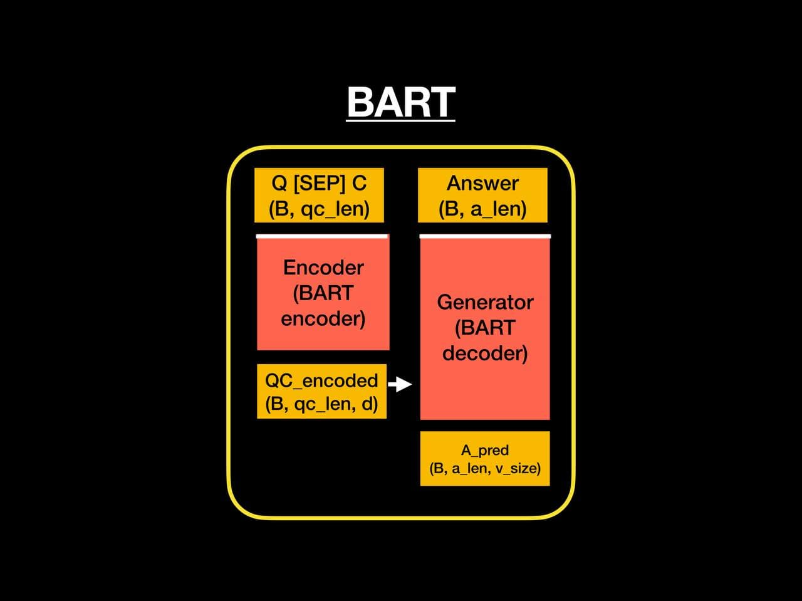
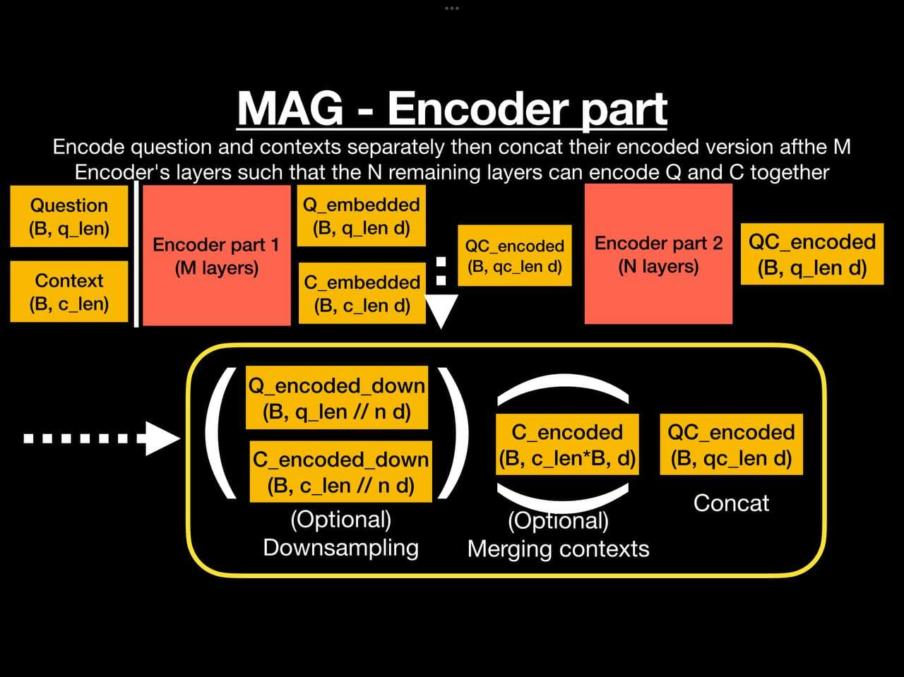
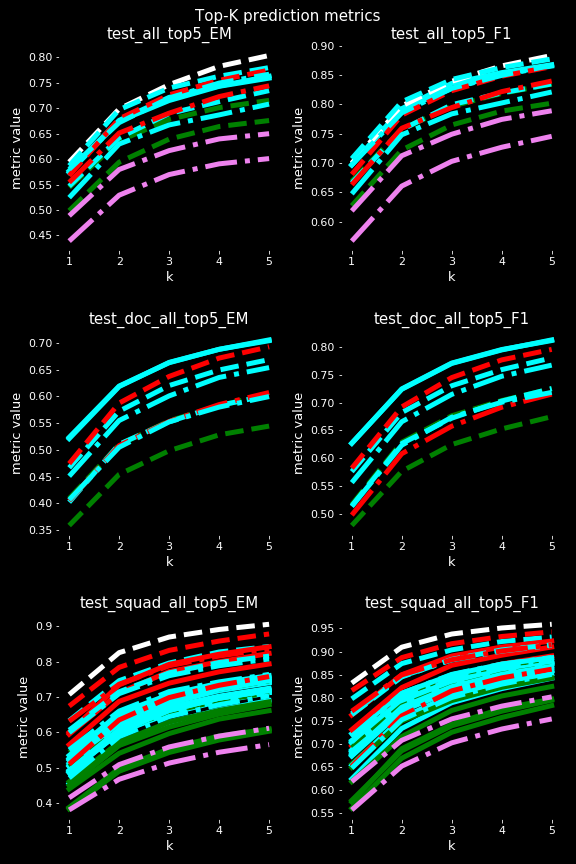

# :yum: Master thesis : Memory Augmented Generator (MAG) : a new approach for question-answering.

- **Author**    : Langlois Quentin
- **Promotor**  : Dupont Pierre
- **Academic year** : 2021-2022
- **Overleaf link** : [link](https://www.overleaf.com/read/cccygzfthhrk)

The objective of this master thesis is to provide a new way to give question / contexts to limit the current constraints and allow to give more knowledge to the model.

## Project structure

```bash
├── custom_architectures/   : custom architectures
├── custom_layers/          : custom layers
├── custom_train_objects/   : custom objects for training
│   ├── callbacks/          : custom callbacks
│   ├── generators/         : custom data generators
│   ├── losses/             : custom losses
│   ├── optimizers/         : custom optimizers / lr schedulers
├── datasets/               : utilities for dataset loading / processing
│   ├── custom_datasets/    : where to save custom datasets processing
├── hparams/                : utility class to define modulable hyper-parameters
├── loggers/                : some logging utilities
├── models/                 : main `BaseModel` subclasses directory
│   ├── classification/     : directory for `BaseClassifier` classes
│   ├── qa/                 : main directory of Q&A models
├── pretrained_models/      : saving directory for pretrained models
├── unitest/                : custom unitest framework to test models' consistency
├── utils/                  : utilities for data processing
├── experiments_mag.py      : main file to run multiple experiments (build / train / test / pred)
├── main.py                 : main file to build or train or test or pred (single model)
├── Makefile / Dockerfile-maggie / docker-compose-maggie.yml    : files to build / run bot container
└── maggie.py               : code for the discord bot

```

See [README.original](README.original.md) for more information on the original project.


## Installation and usage

### Main installation 

1. Clone this repository : `git clone https://github.com/Ananas120/mag.git`
2. Go to the root of this repository : `cd mag`
3. Install requirements : `pip install -r requirements.txt`
4. Open an example notebook and follow the instructions !

### Bot installation

You must have docker and docker-compose installed and NVIDIA drivers (to allow Docker to use GPU)

1. Clone this repository : `git clone https://github.com/Ananas120/mag.git`
2. Go to the root of this repository : `cd mag`
3. Build container : `make build`
4. Run container : `make`
5. Stop the bot : `make down` (or CTRL + C after `make` if you are in the container's console)

## TO-DO list

### General TO-DO list

- [x] Make the TO-DO list.
- [x] Make the `README` file.
- [ ] Add references and citations (done in the report).
- [x] Make a `BERT`-based span retriever model.
- [x] Make a `BART`-based answer generator.
- [x] Make a `Retriever Augmented Generator (RAG)`-style answer generator.
- [ ] Write the final report
    - [x] Write the `introduction` part
    - [x] Write the `background` part
    - [x] Write the `experiments` part
    - [x] Write the `results` part
    - [x] Write the `conclusion` part
    - [ ] Send it to promotor and perform modifications proposed

### MAG experiments' TO-DO list

- [x] Allow to give separately the answer and the context to the `Encoder` part and concat them before giving them to the `Decoder` part.
- [x] Allow to subsample each part (encoded question / context) to a given factor.
- [x] Allow to concat encoded question / context before the `Encoder`'s end.
- [x] Add `type embedding` to each different contexts given at once.
- [x] Add the possibility to add a *context offset* for the contexts' `positional encoding index`
- [x] Add the `batch`-merging mode for contexts (give multiple contexts during training).
- [x] Add the `document`-mode for contexts (give an entire `wikipedia` paragraph at once).
- [x] Allow to split context and pass it as separated sentences
- [x] Perform Google / Bing search to get best results
- [x] Perform Q&A based on a google-search result
- [x] Create a Discord bot

## Answer Generator approaches

There exists multiple approaches of Q&A : 
- Answer Span Retriever
- Multiple Choice Q&A
- Answer Generation :
    - Open-book answer generation : the model has question and context containing the answer.
    - Closed-book answer generation : only give question without context and the model has to keep knowledge in its parameters.

This master thesis will focus on the **Open-book answer generation** and try to improve its capabilities by giving more and more knowledge at once.



## MAG architecture

The `MAG` architecture is a classical `BART` architecture with some additional features to modify the way data are given to the model.





### The M first layers

These layers are classical `BART` encoder's *N* first layers. They first embed the input (`Embedding` + `positional encoding`) then pass it though the *N* first layers.

### The subsampling

Notation : `n` is the `subsampling_step` and `d` is the model's embedding size. 

Once inputs have been encoded by the *N* first layers, I optionnally subsample them. Differents modes are supported : 
- `select`      : simply keep vectors with a step of *n* (`subsampled = encoded[:,::subsampling_step]`, where the 1st dimension is `batch` and 2nd is `seq_len`)
- `mean`        : keep the mean between the *n* consecutive embeddings such that `e[i] = mean(e[i*n : i*n + n]`)
- `dense`       : apply a `Dense` layer to a reshaped version such that the `Dense` layer takes as input the *n* tokens at once (size `d * n`) and produces a single vector of length `d` \*

\* the best initialization I found was to 1st train the model with a `mean` mode then initialize `Dense`'s weights to perform the same `mean`-gehavior then train it.

## Results + parameters' explaination

**Check the report for full analysis and results**

### Main parameters 

Current parameters and their explaination : 
- `question_format`     : the way to give question
- `context_format`      : the way to give context (for instance `'{title}{sep_token}{context}'` means to give the title and its context separated by a special token).
- `max_{input/output}_length`   : maximum length of input / output \*
- `context_offset`      : the offset of contexts' positional encoding \*\*
- `subsample_question`  : whether to subsample the question or not (before the concatenation).
- `encoder_repeat_pos_idx`  : whether to repeat subsampled indexes' positional index (for instance if `subsample_step = 3`, the 3 first tokens will have index 0 and the 3 next ones will have index 1 etc).
- `encoder_subsample_at`    : the number of layers at which to concatenate all encoded question / contexts.
- `encoder_subsample_after` : whether to concat before / after the ith `Encoder` layer (allow to concat before the 1st layer or after the last one).
- `encoder_subsampling_step`    : the subsampling factor.
- `encoder_subsampling_offset`  : how many tokens to skip before subsampling.
- `encoder_subsampling_mode`    : the way to subsample
- `encoder_use_type_embedding`  : whether to add `Embedding` to contexts or not.
- `encoder_max_types`           : the maximum number of contexts we can give at once.

\* **Important** : in classical models, the max input length is the maximum length of question and context concatenated while in `MAG` it is the maximum length for each part individually (the total length can be much larger !).

\*\* In classical model, question and context are given together so the context's start position is equal to the length of the question + 1. In `MAG`, they are given separately so, in theory, start position of both should be 0 but it can produce confusion to the model while this offset allow to remove positional overlap between question and context.

### A first plot of results

Each point represent a trained model, each subplot represents a parameter where x-axis is the parameter's value and y-axis is the `val_loss` of the model. 

Each model has been trained and validated on `NaturalQuestions` and tested on `SQUAD1.0 dev-set` (`test_squad_...`) and on `NaturalQuestions` (`test_...`)

Note that some parameters are not relevant as dependant of other parameters (`shuffle_size = 32 * batch_size`) while some others are memory-dependant (`batch_size`)




**Check the report for the legend**

**Important note on validation / testing** : models have been evaluated the same way they have been trained, meaning that a `batch`-merging model has been validated with `batch_size * 2` paragraphs and a `doc`-based model has been validated with `max_negatives + 1` paragraphs (from the same wikipedia page). This is **not** the case during testing where all models have been tested with 1 paragraph (the relevant one) to have comparable results.

### A first analysis

- **Baseline, the classical approach** :

In below graphes, the classical model is represented by the single green dot : the `AnswerGenerator` class which takes as input `{question}{sep_token}{context}` (Q and C separated by a token).

Its loss is much better than other (0.4 while others are between 0.53 and 0.65) **but** its `Exact Match (EM)` and `F1` are comparable and even a bit lower than some `MAG` models ! Proving that my approach can give comparable / slighly better results while giving **much more** data to the model.

- **Subsampling step impact** :

The `batch_size` shows the impact of `subsampling_step` on memory usage : the higher the step is, the higher the `batch_size` can be.

The `batch` merge mode merges all paragraphes from a single batch to give them to the decoder. It means that the model does not get a question with its associated relevant paragraph (like in classical methods) but get the question with its corresponding paragraph **and** `batch_size -1` other non-relevant paragraphs ! It is the reason why the `subsampling_step` has a big impact on memory usage.

The `subsampling_step` therefore allows to give much more data to the model (instead of `3 * 512`, it allows `4` or `5 * 512` tokens at once at training time, during validation it is twice more) ! \*

It is interesting to see that even by subsampling tokens, results do not decrease dramatically and are still comparable even with a subsampling of 3 (white points) ! It can be observed in `test_F1` where white dots (subsample = 3) have even better results than blue dots (no subsampling) and comparable to red points (subsample = 2).

\* The `512` is an arbitrary choice, in theory `BART` can handle 1024 tokens maximum but in practice, the wide majority of paragraphs is smaller than 512 and it is more convenient for the GPU memory I have access to (16Go).

- **Subsampling mode impact** :

We can observe that the `dense` mode always perform better results than its associated `mean` model. It is normal as the `dense` mode is a fine-tuned version of the `mean` model. However, this mechanism of fine-tuning with a mean-based initialization is required to achieve good results : if not, results are really poor (loss > 3).

- **N and M impact (subsample at)** :

I should make more tests to have a better view of this parameter's impact to better observe its impact on extreme values (0 and 12). 

## Contacts and licence

### Contact me

You can contact me via my student mail : quentin.langlois@student.uclouvain.be

### Original contact / licence

You can contact [me](https://github.com/yui-mhcp) at yui-mhcp@tutanota.com or on [discord](https://discord.com) at `yui#0732`

The objective of these projects is to facilitate the development and deployment of useful application using Deep Learning for solving real-world problems and helping people. 
For this purpose, all the code is under the [Affero GPL (AGPL) v3 licence](LICENCE)

Furthermore, you **cannot** use any of these projects for commercial purpose without my permission. You can use, modify, distribute and use any of my projects for production as long as you respect the terms of the [licence](LICENCE) and use it for non-commercial purposes (i.e. free applications / research). 

If you use this project in your work, please cite this project to give it more visibility ! :smile:

```
@misc{yui-mhcp
    author  = {yui},
    title   = {A Deep Learning projects centralization},
    year    = {2021},
    publisher   = {GitHub},
    howpublished    = {\url{https://github.com/yui-mhcp}}
}
```

## Notes and references

TO-DO